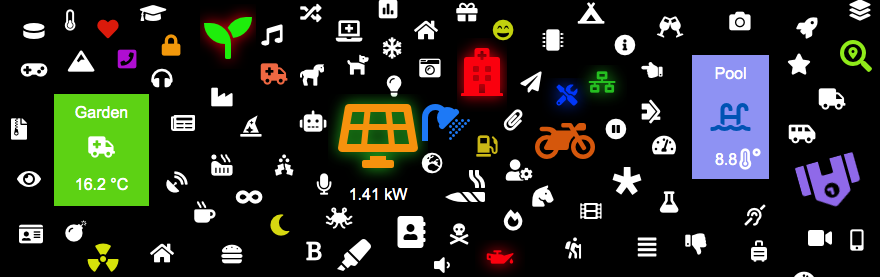

<h1>
	
	ioBroker.fontUI
</h1>

**Tests:** Linux/Mac: 
Windows: 

## fontUI adapter for ioBroker

#### Widget collection using Font Awesome Icons

The icons(1500+) are easy to use and integrate in existing ioBroker VIS designs.
Searchable icon list: https://fontawesome.com/icons?d=gallery&m=free

## Functions

* Include icons with or without state in your existing designs with easy-to-use searchable icon list
* Apply animations like glowing or spinning to the icons
* Change size, color, rotation or animation speed
* (planned) additional animations
* (planned) icon touch buttons

### Displaying/hiding icons when a state changes

To create visualisations like "if state > 100 icon should glow red" just place two(or more) icons in top of each other
and use the already build-in visibility options from ioBroker VIS. Invisible icon animations don't waste Browser resources.

#### Using the icon font in other widgets
You can use the icons in any widget that allows HTML content. To display an icon within another widget just enter
 
 `<i class="fas fa-home fa-2x"></i>`
 
`home` is the icon name and `2x` is the relative size.

This should work with most widgets(I tested a few), but there may be some widgets where the icon doesnt display correctly.

#### Compatibility

FontUI Should work in most modern browsers like Chrome or Firefox(tested), go easy on the size of the icons when applying lots of animations, they can get very CPU intensive very fast.
### Changelog

### 0.1.1
* (runsnbunsn) update Font-Awesome to 5.10, adding about 300 new or changed icons

### 0.1.0
* (runsnbunsn) add searchable autocomplete list of icons with preview
* (runsnbunsn) add more animation options and settings
* (runsnbunsn) add translations

### 0.0.3

* (runsnbunsn) Fix ALL icons getting cutted on the top

### 0.0.2
* (runsnbunsn) Add options to rotate or spin the icons
* (runsnbunsn) Fix some icons getting cutted on the top

### 0.0.1
* (runsnbunsn) initial release

## License
MIT License

Copyright (c) 2019 Felix Mayerhofer

Permission is hereby granted, free of charge, to any person obtaining a copy
of this software and associated documentation files (the "Software"), to deal
in the Software without restriction, including without limitation the rights
to use, copy, modify, merge, publish, distribute, sublicense, and/or sell
copies of the Software, and to permit persons to whom the Software is
furnished to do so, subject to the following conditions:

The above copyright notice and this permission notice shall be included in all
copies or substantial portions of the Software.

THE SOFTWARE IS PROVIDED "AS IS", WITHOUT WARRANTY OF ANY KIND, EXPRESS OR
IMPLIED, INCLUDING BUT NOT LIMITED TO THE WARRANTIES OF MERCHANTABILITY,
FITNESS FOR A PARTICULAR PURPOSE AND NONINFRINGEMENT. IN NO EVENT SHALL THE
AUTHORS OR COPYRIGHT HOLDERS BE LIABLE FOR ANY CLAIM, DAMAGES OR OTHER
LIABILITY, WHETHER IN AN ACTION OF CONTRACT, TORT OR OTHERWISE, ARISING FROM,
OUT OF OR IN CONNECTION WITH THE SOFTWARE OR THE USE OR OTHER DEALINGS IN THE
SOFTWARE.